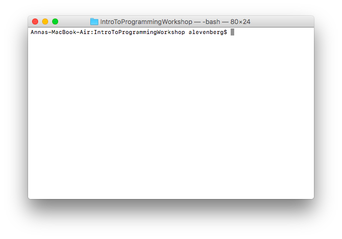
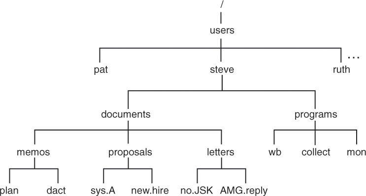

# Overview

* [Why use the terminal?](#why-use-the-terminal)
* [How to Open the Terminal](#how-to-open-the-terminal)
* [File Structure](#file-structure)
* [Terminal Navigation](#terminal-navigation)
* [Basic Commands](#basic-commands)
* [Input and Output Processing](#input-and-output-processing)


# Using the Terminal

The terminal is a command line interface which takes commands from a user, lets the computer process the commands, and displays the output.

## Why use the terminal?
While graphical user interfaces (GUIs) are helpful for a lot of things, sometimes command line interfaces (CLIs) are the better tool for the job.

As an example, imagine you have a messy folder, and you want to combine all the .txt files into a new file called `newfile.txt`. If you use a GUI, this seems like a tedious task, but it only takes one line in the terminal.

```
cat *.txt > newfile.txt
```

## How to Open the Terminal

### Mac OS
Follow these steps to open the terminal:

1. Open *Finder* from the Dock.
2. Open your *Applications* folder.
3. Open *Utilities*.
4. Double click on *Terminal*.



### Ubuntu
Hit the keyboard shortcut Ctrl - Alt - T, or search for it via the menu at the bottom of the dock.

### Windows
Windows also has a built-in terminal, Command Line (or `cmd`); however, Command Line differs greatly from the shells on Mac and Linux, so we will not cover the specifics of how to work with it.

The Windows installation of Git comes with a version of Bash (the shell found on Mac and Linux). **This tutorial follows Bash conventions, so we recommend installing Git for Windows users**. You can get Git (and its version of Bash) [here](https://git-for-windows.github.io/).

*Note:* If you'd prefer, Windows comes with Powershell, which supports many common Linux commands.

## File Structure
### Directories
Computers organize files with directories. A directory contains a group of files. If you want, you can create subdirectories within a directory to organize further.

*Note:* Each file within a given directory must have a unique name, but files contained in different directories do not.

#### Home Directory and Pathnames
Unix associates each user with a directory. When you open your terminal, you are placed in your home directory.



The **root** directory is at the top of the file tree (a couple layers above all of the home directories).

When you are inside a directory, it is called your **current working directory**.

You can change directories by specifying the appropriate pathname. There are two ways to specify a pathname.

**1. Absolute Pathname**: Describes how to reach a file from the root directory.

```
/Users/username/hackbu/IntroToProgrammingWorkshop
```
*Note:* Absolute pathnames always begin with a `/` (slash).

**2. Relative Pathname**: Describes how to reach a file from the current directory.

```
./sample_directory/sample.txt
```
*Note:* Relative pathnames will never begin with a  `/` (slash), and by convention, `..` always refers to the parent directory (one level higher than your current directory) and `.` refers to your current directory.

## Terminal Navigation
Here's a list of helpful commands for moving around your computer's filesystem.

* `pwd` tells you what directory you are in
* `cd destination_directory` moves you from your current directory into the directory you specify
* `ls` lists the files in your current directory
* `mv source_file destination_file` renames `source_file` as `destination_file`

## Basic Commands

* `man command_name` opens a manual page for the command you provide -- to exit the manual, press `q`
* `echo "hello"` prints out `hello` to the command line
* `touch filename` creates an empty file with the specified name
* `cat filename` prints the contents of the specified file
* `cp source_file destination_file` creates a copy of `source_file` named `destination_file`
  - *Note:* It will overwrite the destination file if one of the same name already exists
* `rm file` removes the specified file
  - *Note:* You can remove more than one file at a time by specifying multiple files, e.g. `rm file_1 file_2 file_3`
* `mkdir directory_name` creates a directory with the specified name
* `rmdir directory_name` removes the specified directory (only if it's empty)
  * *Note:* If you want to remove a directory and its contents, you can use `rm -rf directory_name`
### Cheatsheet
| Command |                 What it means                  |
| ------- | :--------------------------------------------: |
| man     | get the manual pages of a command if available |
| pwd     |            print working directory             |
| ls      |                   list files                   |
| cd      |                change directory                |
| cat     |             display file contents              |
| cp      |             make a copy of a file              |
| mkdir   |                make a directory                |
| mv      |             rename or move a file              |
| rm      |                 remove a file                  |

## Input and Output Processing

### Output Redirection

You can use `>` to redirect output from the terminal interface to another file, for example:
```
$ echo hello
hello
$ echo hello > file
$ cat file
hello
```
*Note:* This will overwrite any existing data. To append text instead of overwriting it, you can use `>>`:

```
$ echo hello again >> file
$ cat file
hello
hello again
```
*Note:* If you want to append or write the contents of one file to another, you can redirect the output of the `cat` command.

### Input Redirection

You can use `<` to redirect input from a file. Only use this when a program takes user input during execution (as opposed to from arguments like we've been using).

*Note:* Some commands should be used with input redirection. For example, the `wc -l` command returns the number of lines from a given file:

```
$ wc -l < file.txt
8
```