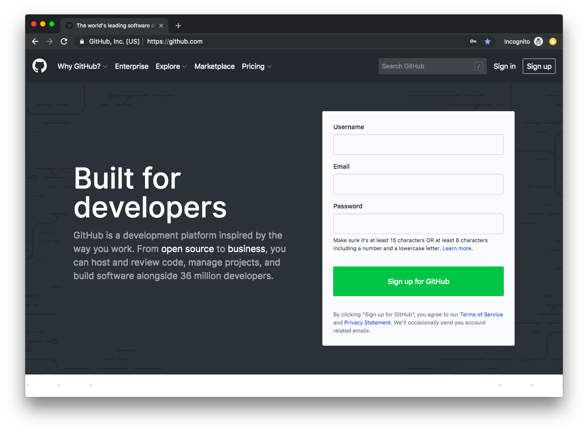

# Intro to Programming

- [What is the terminal?](#what-is-the-terminal)
  * [Why use the terminal?](#why-use-the-terminal)
  * [How to open the terminal](#how-to-open-the-terminal)
  * [File Structure](#file-structure)
  * [Terminal Navigation](#terminal-navigation)
  * [Basic Commands](#basic-commands)
  * [Cheatsheet](#cheatsheet)
- [Input and Output processing](#input-and-output-processing)
  * [Output redirection](#output-redirection)
  * [Input redirection](#input-redirection)
- [Version Control](#version-control)
  * [Why use Git?](#why-use-git)
  * [Git and Github](#git-and-github)
  * [Getting Started](#getting-started)
  * [Basic git commands](#basic-git-commands)
  * [Pull Requests](#pull-requests)
  * [Best Practices](#best-practices)

## What is the terminal?

The terminal is a command line interface which takes commands from a user, lets the computer process the commands, and displays the output through a command line interface.

### Why use the Terminal?
While graphical user interfaces (GUIs) are helpful for a lot of things, sometimes command line interfaces (CLIs) are the better tool for the job.
As an example, imagine you have a messy folder, and you want to combine all the .txt files into a new file called "newfile.txt". If you use a GUI, this seems like a tedious task, but it only takes one line in the *shell*.

```
cat *.txt > newfile.txt
```

### How to open the terminal

### Mac OS
1. Open Finder from the Dock.
2. Open your Applications folder.
3. Open Utilities.
4. Double click on Terminal.


### Ubuntu
Hit the keyboard shortcut Ctrl - Alt - T.

### Windows
Windows also has a built-in terminal, Command Line. Command line differs greatly from the shells on Mac and Linux.

Thankfully, Windows comes with Powershell, which supports many common Linux commands.

The Windows installation of Git comes with a version of Bash (the shell on Mac and Linux). This tutorial mostly follows Bash conventions, so we recommend installing Git for Windows users. You can get Git (and its version of Bash) [here.](https://git-for-windows.github.io/)

### File Structure
#### Directories

Computer programs organize files with directories. A directory contains a set of related files. If you want, you can create subdirectories with a directory to organize more. Each file within a given directory must have a unique name, but files contained in different directories do not. For example, this file is in the IntroToProgrammingWorkshop directory.

#### Home Directory and Pathnames
Unix associates each user with a directory. When you log in, you are placed in your home directory.


The **root** directory is at the top of the file tree.

When you are inside a directory, it is called your **current working directory**.

You can change directories by specifying the appropriate pathname. There are two ways to specify a pathname.

**Absolute Pathname**: tells how to reach a file from the root

```
/Users/username/hackbu/IntroToProgrammingWorkshop
```
Always will begin with a `/` (slash).

**Relative Pathname**: tells how to reach a file from the current directory
```
./sample_directory/sample.txt
```
Never will begin with a  `/` (slash).

By convention `..` will refer to the parent directory (one level higher than your current directory) and `.` refers to your current directory.

### Terminal Navigation
* `pwd` tells you what directory you are in
* `cd destination_directory` change from your current directory
* `ls` lists the files in your current directory
* `mv source_file destination_file` can rename the source_file as the destination_file name

### Basic Commands

* `man` a manual for more information about commands
  - Sample command: `man pwd`.
  - To exit the information, press `q`
* `echo hello` prints out "hello" to the command line
* `touch filename` creates an empty file with the specified name
* `cat filename` prints the contents of the current file
* `cp source_file destination_file` creates a copy of source_file named after the destination_file
  - Note: it will overwrite the destination file
* `rm file` removes the file specified
  - You can remove more than one file at a time by specifying multiple, i.e. `rm file_1 file_2 file_3`
* `mkdir directory_name` creates a directory with the specified name
* `rmdir directory_name` removes the directory (will only let you use if it's empty)
- If you want to remove a directory and its contents, you can use `rm -r directory`

### Cheatsheet
| Command        | What it means            |
| ------------- |:-------------:|
| man     | get the manual pages of a command if available |
| pwd     | print working directory |
| ls      | list files      |
| cd | change directory      |    
| cat | display file contents      |    
| cp | make a copy of a file  |    
| mkdir | make a directory  |    
| mv | rename or move a file  |    
| rm | remove a file |    

## Input and Output processing
### Output redirection
You can use `>` to divert an output to another file
```
$ echo hello >> file
$ cat file
hello
```
Note: this will overwrite any existing data. To avoid this, you can use `>>` to **append** text
```
$ echo hello again > file
$ cat file
hello
hello again
```
You can use `cat` to append the contents of one file onto another.

### Input redirection

You can use `<` to redirect input from a file. For example, the `wc -l` command returns the number of lines from a given file.
```
$ wc -l < file.txt
8
```

#### Pipes

Pipes `|` connect the output of one command to the input of another.

## Version Control
**Version control** is a system that records changes to a file or set of files over time so that you can recall specific versions later.

### Why use Git?
- Keep a history of your work
- Undo bad changes
- Work on the same project with others (but be wary of merge conflicts)
- Backup your code to the internet

### Git and Github

What's the difference between Git and GitHub? Git is a distributed version-control system for tracking changes in source code, while Github is a company that provides hosting for Git.

#### What can I store in Git?
Short answer: anything!

Longer answer: Anything that is in a plain-text format (source code, text files, html) can be tracked by Git very well.
Binary files also can be tracked, but you shouldn't put certain binary files into Git.
You shouldn't add generated executable files and object-code (.class, .pyc) because those files can be built using the source code.
Images are generally okay to add, GitHub will even show the differences in images!

#### Installing Git and Making a Github account

Follow the [instructions](https://git-scm.com/book/en/v2/Getting-Started-Installing-Git) to install git.

##### Linux
Install git using your package manager e.g. `sudo apt install git`.

##### Mac OSX
Open a terminal and type `git`.
If you get a prompt to install xcode command line tools, let it install.
If you're impatient or want the latest version, you can install Git with this [download](https://git-scm.com/download/mac)
You may need to follow [this guide](https://github.com/timcharper/git_osx_installer#i-have-xcode-installed-and-consequently-its-bundled-git-how-do-i-get-my-system-to-use-this-version-instead) if you use the second option.

##### Windows
You can download Git and a Terminal from [here](https://git-for-windows.github.io/).

Go to [Github](https://github.com/) and sign up for an account.



Note: If you're a student, you can apply for the pro version by following [these instructions](https://help.github.com/en/articles/applying-for-a-student-developer-pack).

### Getting Started

##### Configure Git
```
# Setting user name and email
git config --global user.name "Test User"'
git config --global user.email "testuser@gmail.com"'
```

##### Make a project
In your terminal type `mkdir myproject` and `cd myproject` to create and enter a project directory.

To make your current directory a git repository, just type `git init`.

Now that you have a directory with git, you can use the directory just like any other directory.
Write or copy some files into the directory, and then type `git status`.

This will show you the current status of what's available to add to Git.
Under untracked files, you'll see the files that are in the directory, but not stored in Git.

###### Saving changes
To start tracking a file, type `git add myfile.txt`.
This hasn't saved the changes yet because we need to ask git to do that first.
Add any other files with `git add otherfile.txt coolpicture.jpg etc.`.

When you're ready to save your changes, type `git status` to review what's going to be saved.
If it all looks good, type `git commit -m "Write something descriptive here"`.

To see what was saved, type `git show`. If you want to see a log of all of your previous commits, type `git log`.

### Basic git commands
| Command        | What it means            |
| ------------- |:-------------:|
| `git init`   | initializes an empty git repository|
| `git add .`     | adds all files |
| `git add <file1>`     | add a specific file |
| `git add <folder>`     | add a folder |
| `git remove <file>`     | remove a specific file |
| `git commit <file> -m  "message"`      | commits with a message      |
| `git log`      | disply git commit history    |
| `git status`      | show files added to the index, files with changes, and untracked files |
| `git pull`      | fetches from remote to merge with the current branch |
| `git push`      | uploads local content to a remote repository |
| `git clone <url> `      | clone a repository from a url      |

#### Common git flow

```
git init # only needed once
git add <file>
git commit -m "commit message"
git remote add origin <repo_name> # only needed once
git push -u origin master
```

### Pull Requests
Pull requests help users contribute to shared repositories. If you're interested in learning more about how to make a pull request, check out [this section](making_a_pull_request.md)

### Best Practices
#### Commit often
Commits should be made as **frequently** as possible. Frequent commits allow you to easily revert changes.

#### Leave descriptive commits
Commits should act as snapshots of your code. By adding descriptive commits, you'll make it easier to identify what your changes did.
